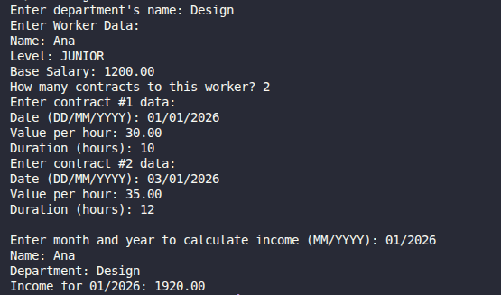

# 💼 Worker Income Calculator (CLI)

> Aplicação em Java para calcular a renda mensal de um trabalhador com base em contratos por hora.

---



---

## 🧠 Sobre o projeto

Este projeto simula um sistema onde um trabalhador pertence a um departamento e possui vários contratos de trabalho por hora.  
Com base nesses contratos, o sistema calcula a renda total em um determinado mês e ano.

## 🏗️ Estrutura do projeto

`Program.java` → Classe principal (entrada do sistema)
* `entities/`
  * `Worker.java` → Representa o trabalhador
  * `Department.java` → Representa o departamento
  * `HourContract.java` → Representa contratos por hora
* `enums/`
  * `WorkerLevel.java` → Nível do trabalhador (JUNIOR, MID_LEVEL, SENIOR)

## 🚀 Tecnologias utilizadas

- Java
- Programação Orientada a Objetos (POO)
- Enum
- Listas (`ArrayList`)
- Manipulação de datas (`Date`, `Calendar`, `SimpleDateFormat`)

## ⚙️ Funcionalidades

Criar um trabalhador com:
  * Nome
  * Nível
  * Salário base
  * Departamento

Adicionar múltiplos contratos com:
  * Data
  * Valor por hora
  * Duração (horas)

Calcular a renda total com base em:
  * Salário base
  * Contratos de um mês específico

## ▶️ Como executar

1. Clone o repositório:

```bash
git clone https://github.com/aninha-jpg/worker-income-calculator.git
```

2. Compile o Projeto:

```bash
javac Program.java
```

3. Execute:

```bash
java Program
```

## 📚 Aprendizados

Este projeto foi desenvolvido como parte dos meus estudos no curso de Java, do professor Nélio Alves.


*  Uso de orientação a objetos na prática
*  Relacionamento entre classes
*  Uso de listas para armazenar dados
*  Manipulação de datas em Java
* Uso de enums para representar estados fixos