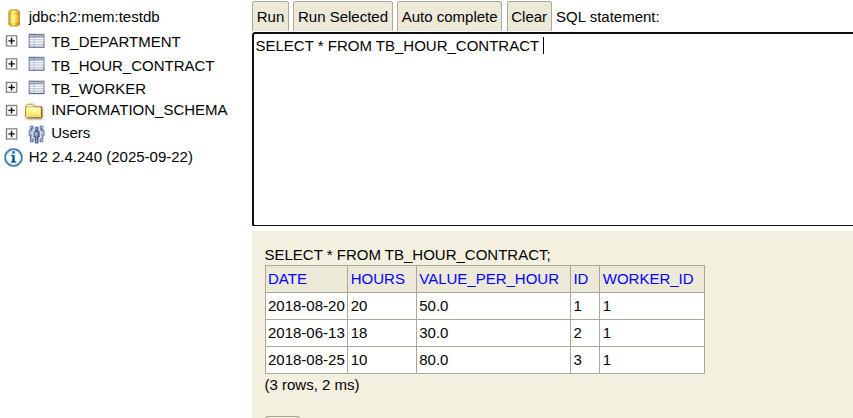
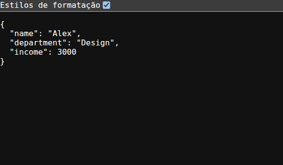

# 💼 Worker Income API

> API REST desenvolvida em Java com Spring Boot durante o curso do Prof. Nélio Alves, para cálculo de renda de trabalhadores com base em contratos por hora.

---

## 🧠 Sobre o projeto

Este projeto simula um sistema de gerenciamento de trabalhadores, onde cada trabalhador possui:

- Nome  
- Nível (Junior, Mid-Level, Senior)  
- Departamento  
- Salário base  
- Contratos de trabalho por hora  

A aplicação calcula a renda total do trabalhador em um mês e ano específicos, somando o salário base com os contratos daquele período.

---

## ⚙️ Funcionalidades

- Cadastro de trabalhadores e departamentos  
- Associação de contratos por hora ao trabalhador  
- Cálculo de renda mensal via API REST  
- Consulta de dados via endpoint HTTP  

---

## 🚀 Tecnologias utilizadas


- Spring Boot  
- Spring Data JPA / Hibernate  
- Maven Wrapper  
- H2 Database  
- Programação Orientada a Objetos (POO)  

---

## 🗄️ Banco de dados

O projeto utiliza o banco H2 em memória para testes e desenvolvimento, facilitando a execução sem necessidade de configuração externa.



---

## 📡 Endpoint principal

### Calcular renda do trabalhador

```http
GET /worker/{id}/income/{year}/{month}
```

### Exemplo

```http
GET /worker/1/income/2018/8
```

### Resposta



---

## ▶️ Como executar

1. Clone o repositório:

```bash
git clone https://github.com/aninha-jpg/worker-income-calculator.git
```

2. Entre na pasta do projeto:

```bash
cd worker-income-calculator
ls
cd worker
```

3. Execute a aplicação:

### 
```bash
./mvnw spring-boot:run
```

### 
```bash
./mvnw spring-boot:run
```

### 
```bash
mvnw spring-boot:run
```

4. Acesse:

```text
http://localhost:8080
```

---

## 📚 Aprendizados

- Criação de API REST com Spring Boot  
- Uso de JPA/Hibernate para persistência de dados  
- Modelagem de entidades e relacionamentos  
- Uso de DTO para transferência de dados  
- Manipulação de dependências com Maven Wrapper  
- Uso de banco em memória (H2)  
- Boas práticas com arquitetura em camadas  
